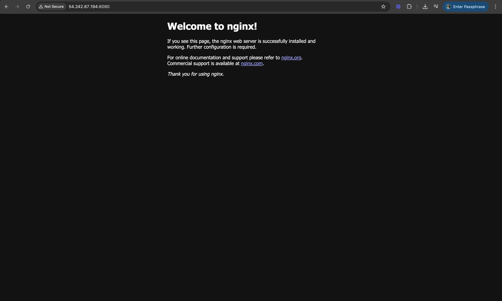

# 3 Tier Web Application with Terraform

This repository contains the Terraform code to deploy a 3 Tier Web Application on AWS.

---

## 🚀 What This Does

- Creates a **Custom VPC**
- Creates a **EC2 IAM Role**
- Sets up **Public and Private subnets**
- Configures **Internet Gateway** **Nat Gateways** and **Route Tables**
- Defines **Security Groups** to allow traffic to port 8080
- Launches an **EC2 instance**
  - With a **user-data script** that:
    - Installs Docker
    - Runs an **NGINX server** in a container on port `8080`

---

## 🛠️ Prerequisites

Make sure you have:

- [Terraform](https://developer.hashicorp.com/terraform/install) installed
- An AWS account and credentials configured (via `~/.aws/credentials`, environment variables, or IAM roles)

---

## ⚙️ How to Use

### 1. Clone the repo
```
git clone https://github.com/your-username/your-terraform-repo.git
cd your-terraform-repo
```
### 2. Initialize Terraform
```
terraform init
```
### 3. Preview the Plan
```
terraform plan
```
### 4. Apply the Configuration
```
terraform apply
```
### 5. Access Your EC2 Instance
```
ssh -i /path/to/your-key.pem ec2-user@<public_ip>
```
## 🌍  Accessing the NGINX Server

After deployment, Terraform will output the public IP of your EC2 instance.
```
Open your browser and go to:

http://<public_ip>:8080
```
You should see the NGINX welcome page served from inside the Docker container.


---

## 🧹 Destroying the Infrastructure
```
terraform destroy
```
---

📝 Notes

- Ensure that the security group allows inbound traffic on port 8080.

- The Docker container maps host port 8080 to container port 80.

- The bash script ``firstscript.sh`` automates Docker installation and container setup on boot.

- Run terraform destroy to clean up 


